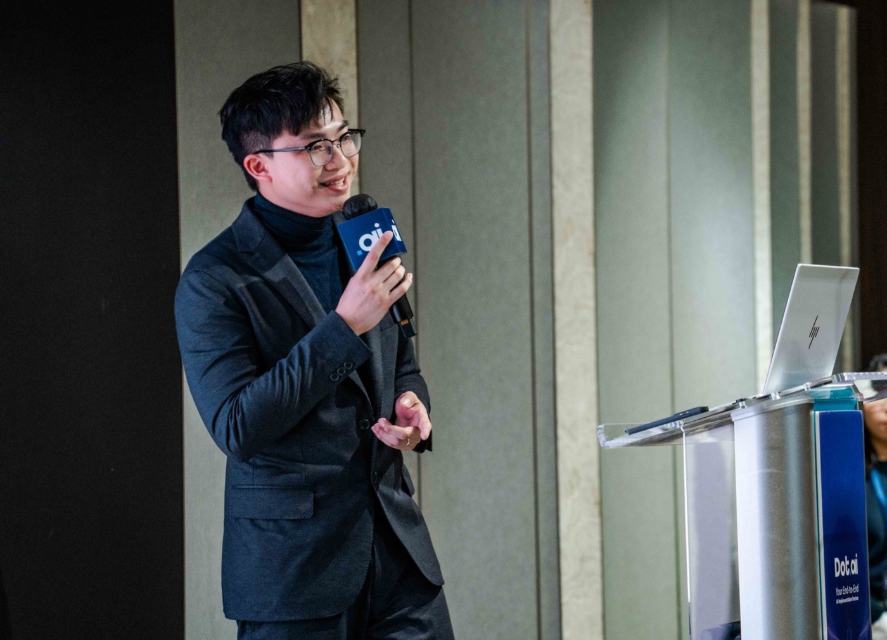

<p align="center">
  
</p>

# 我係 Jimmy Lau

**DotAI Co-Founder／CMO**

`Designer → Marketer → Growth Marketer → AI Growth Builder`

我將 Marketing 人平時做 Research、策劃、內容、Campaign 同增長嘅判斷，寫成 AI 可以重複執行、人可以理解、團隊可以持續改善嘅工作方法。

> 我唔係想用 AI 一次過生成更多內容。
>
> 我想將真正有效嘅做事方法，變成可以安裝、測試、交接同改造嘅 Skills。

## 公開目錄

我會將所有已公開、可以直接試用嘅 Tools、Skills 同 Guides 放喺呢度。唔係所有想法都會放上嚟；只會放我自己願意用、願意繼續改善嘅作品。

| 類別 | 作品 | 你可以用嚟做乜 |
| --- | --- | --- |
| 🧩 Tool | [DotAI Collage Studio](https://github.com/jimmylau-DOTAI/dotai-collage-studio) | 將 1–9 張活動相拼成可以出 IG／Facebook 嘅 JPG；本機處理相片。 |
| ⚙️ Skill Kit | [10x AI Growth Marketing Kit](https://github.com/jimmylau-DOTAI/10x-ai-growth-marketing-kit) | 將 Research、內容、Campaign 同增長工作，變成 AI 可以重複執行嘅 Skills。 |
| 📚 Guide | [Growth with AI](https://github.com/jimmylau-DOTAI/growth-with-ai-guide) | 用廣東話由第一件真 AI 工作，行到可交接、可驗收嘅 AI workflow。 |

新工具、新 Skills 同新攻略完成公開 QA（PS：公開前檢查）後，都會加返入呢個目錄。

## 我專注嘅工作

- **AI Marketing Skills & Workflows**：將個人判斷變成 Agent 可以執行嘅流程；
- **Company Brain**：建立可以重複使用嘅公司、產品、客群同品牌 Context；
- **Content Research**：先確認 Sources，再分開 Evidence、Interpretation 同可發展角度；
- **Full Funnel Campaigns**：由 Business Outcome、Audience、Offer 一路接到 CTA 同 Measurement；
- **SEO／GEO & Social Content**：由搜尋問題同可靠觀點出發，製作真正適合渠道嘅內容；
- **AI Education & Adoption**：幫非技術背景嘅 Marketer 學識建立自己嘅 AI 工作方法。

## 我嘅做事方法

```text
Context
   ↓
Evidence
   ↓
Strategy
   ↓
Production
   ↓
Human Review
```

AI 可以幫我哋加快 Research、整理、挑戰、起 Draft 同建立 Handoff。

但事實、品牌立場、客戶資料、預算同正式發布，仍然要由人負責。

## 我嘅路徑

### Designer

學識由使用者、訊息、結構同體驗出發，而唔係只處理表面視覺。

### Marketer

將設計思維放入品牌、內容、Campaign 同客戶溝通。

### Growth Marketer

開始將渠道、Funnel、Conversion、數據同實驗連成一個系統。

### AI Growth Builder

將呢啲工作判斷寫成 Skills、Workflows 同 AI 可以協作執行嘅增長系統。

## 我而家想做嘅事

我會繼續將真正做緊嘅 Marketing 工作，拆成可以公開學習、安裝同修改嘅 Skills。

我希望其他人唔只係複製 Jimmy 嘅答案，而係學識問：

1. 我平時根據甚麼資料作判斷？
2. 邊個步驟唔可以跳過？
3. 甚麼結果先算真正完成？

當你開始將呢啲答案寫入 Skill，你就由 AI User 行前一步，開始成為 AI Builder。

---

### 由呢度開始

👉 [打開 10x AI Growth Marketing Kit](https://github.com/jimmylau-DOTAI/10x-ai-growth-marketing-kit)
